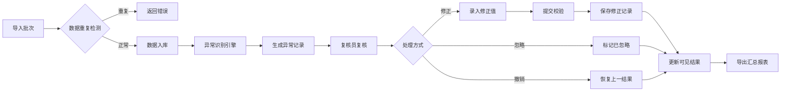
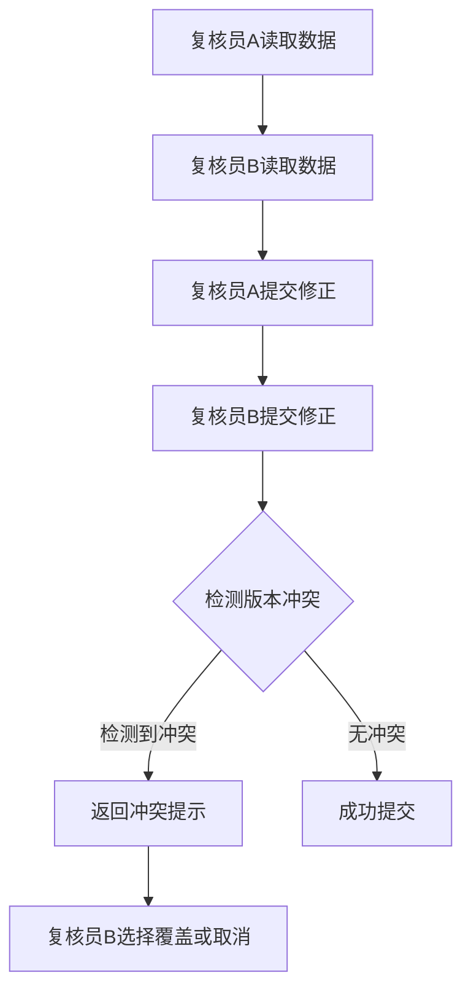
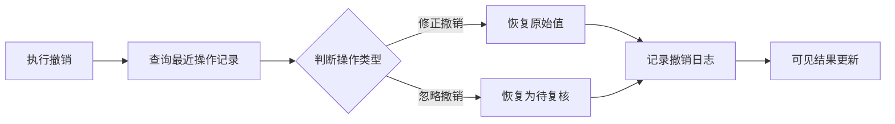

# 能源计量数据异常复核与修正系统

## 1. 产品概述

针对园区能源管理场景的智能化抄表数据审核平台，解决人工核查效率低、易遗漏、追溯难等问题。通过自动化异常识别与流程化复核机制，确保能源计量数据的准确性与完整性，同时保留完整的审计追踪记录。

- 核心目标：提高能源数据质量，降低人工核查成本，确保数据可追溯性
- 目标用户：园区能源管理人员、数据复核员、系统管理员

## 2. 核心功能

### 2.1 用户角色

| 角色 | 权限范围 | 核心职责 |
|------|----------|----------|
| 复核员 | 导入数据、识别异常、修正/忽略异常、导出报表 | 日常数据审核与修正 |
| 管理员 | 规则配置、版本管理、用户管理、全部复核员权限 | 系统配置与异常规则维护 |

### 2.2 功能模块

#### 2.2.1 数据导入模块
- **批量导入**：支持Excel/CSV格式的水、电、气三类读数
- **批次管理**：批次号自动生成，支持按批次查询、删除
- **重复导入拦截**：检测相同批次号或完全相同数据的导入请求，阻止重复数据入库

#### 2.2.2 异常识别模块
- **跳变检测**：当本次读数与上次读数差值超过设定阈值时标记为跳变异常
- **缺失检测**：当指定时间点无读数记录时标记为缺失异常
- **回退检测**：当本次读数低于上次读数时标记为回退异常（需人工介入，不能自动修正）
- **自动标记**：导入时自动执行所有异常检测规则

#### 2.2.3 复核修正模块
- **异常列表**：展示所有待复核异常记录
- **修正操作**：复核员输入修正值，系统记录修正前后对比
- **忽略操作**：复核员确认异常无需修正，标记为已忽略
- **撤销操作**：恢复上一可见结果，保留历史操作记录
- **冲突拦截**：当两个复核人同时提交不同修正时，后提交者被系统拦截

#### 2.2.4 规则配置模块
- **阈值配置**：设置跳变、缺失的判定阈值
- **版本管理**：保存规则配置的历史版本，支持版本对比与回滚
- **配置生效**：规则修改后仅影响后续导入数据，历史数据不受影响

#### 2.2.5 数据导出模块
- **明细导出**：导出修正后的完整读数明细
- **汇总报表**：按能源类型、日期范围统计总量与异常数
- **历史追溯**：导出记录包含原始值、修正值、操作人、时间戳

### 2.3 页面详情

| 页面名称 | 模块名称 | 功能描述 |
|----------|----------|----------|
| 仪表盘 | 数据概览卡片 | 显示今日导入数、待复核数、本月异常率 |
| 数据导入 | 导入表单、批次列表 | Excel上传、批次查询删除 |
| 异常复核 | 异常表格、修正面板 | 异常筛选、批量操作、修正/忽略/撤销 |
| 规则配置 | 阈值表单、版本历史 | 阈值设置、保存、版本切换 |
| 导出中心 | 导出表单、下载列表 | 日期范围筛选、报表生成与下载 |

## 3. 核心流程

### 3.1 主流程（导入-识别-复核-导出）



### 3.2 冲突检测流程



### 3.3 撤销恢复流程



## 4. 用户界面设计

### 4.1 设计风格
- **视觉定位**：工业控制台风格，强调数据清晰度与操作效率
- **色彩体系**：
  - 主色：深蓝色 `#1a365d`，传达专业可靠
  - 强调色：警示橙 `#dd6b20`（异常）、成功绿 `#38a169`（正常）
  - 背景：浅灰 `#f7fafc`，卡片白 `#ffffff`
- **字体**：思源黑体（中文）/Roboto Mono（数据）
- **布局**：左侧导航 + 顶部面包屑，卡片式内容区
- **图标**：线性风格，配套状态色

### 4.2 页面设计

#### 仪表盘页面
- **顶部卡片**：今日导入数、待复核数、本月异常率（百分比环图）
- **中部图表**：近7天导入趋势折线图
- **底部列表**：最新5条待复核异常快速入口

#### 数据导入页面
- **上传区域**：拖拽上传框，显示支持格式提示
- **批次表格**：批次号、导入时间、数据条数、异常数、操作列
- **状态标签**：处理中（蓝）、已完成（绿）、有异常（橙）

#### 异常复核页面
- **左侧筛选**：能源类型、异常类型、时间范围、批次号
- **中央列表**：异常记录卡片，含原始值、异常类型、复核状态
- **右侧面板**：选中记录详情、修正表单、备注输入
- **批量操作栏**：底部固定，支持批量忽略/导出

#### 规则配置页面
- **配置表单**：跳变阈值（百分比）、缺失判定天数、回退检测开关
- **版本历史**：时间线展示历史配置版本，支持一键回滚
- **版本对比**：新旧版本差异高亮显示

#### 导出中心页面
- **筛选区**：日期范围、能源类型、批次选择
- **预览区**：数据明细表格（只读）
- **汇总区**：总量统计卡片、异常统计
- **操作区**：导出为Excel按钮

## 5. 数据模型

### 5.1 核心实体

| 实体 | 字段 | 说明 |
|------|------|------|
| MeterReading | id, meterId, readingDate, rawValue, correctedValue, meterType, batchId, status | 读数记录 |
| Anomaly | id, readingId, anomalyType, detectedAt, status, resolvedAt, resolvedBy | 异常记录 |
| Correction | id, anomalyId, originalValue, newValue, operator, operatedAt, version | 修正记录 |
| RuleConfig | id, configKey, configValue, version, effectiveFrom, effectiveTo, updatedAt | 规则配置 |
| Batch | id, batchNo, importedAt, totalCount, anomalyCount, importedBy | 导入批次 |
| ExportRecord | id, exportType, params, downloadedAt, downloadedBy | 导出记录 |

### 5.2 状态流转

```
MeterReading.status:
  RAW -> ABNORMAL -> CORRECTED / IGNORED

Anomaly.status:
  PENDING -> CORRECTED / IGNORED / REVERTED

Correction.version:
  单调递增，用于冲突检测
```

## 6. 验收标准

### 6.1 功能验收

| 编号 | 测试场景 | 预期结果 |
|------|----------|----------|
| F1 | 导入样例批次数据 | 数据成功入库，异常自动识别 |
| F2 | 重复导入同一批次 | 系统拒绝，提示批次已存在 |
| F3 | 复核员A和B同时修改同一记录 | 后提交者收到冲突警告 |
| F4 | 执行修正操作 | 原始值保留，修正值更新，状态变更 |
| F5 | 执行撤销操作 | 可见结果恢复，历史记录保留 |
| F6 | 修改阈值配置 | 新规则生效，旧数据不受影响 |
| F7 | 导出汇总报表 | 数据与界面显示一致 |
| F8 | 系统重启 | 所有状态恢复一致 |

### 6.2 性能要求
- 批量导入1000条数据响应时间 < 3秒
- 异常识别处理时间 < 1秒
- 页面切换响应时间 < 200ms

### 6.3 数据一致性
- 原始值不可覆盖
- 每次操作均有时间戳和操作人记录
- 版本号单调递增，支持冲突检测
