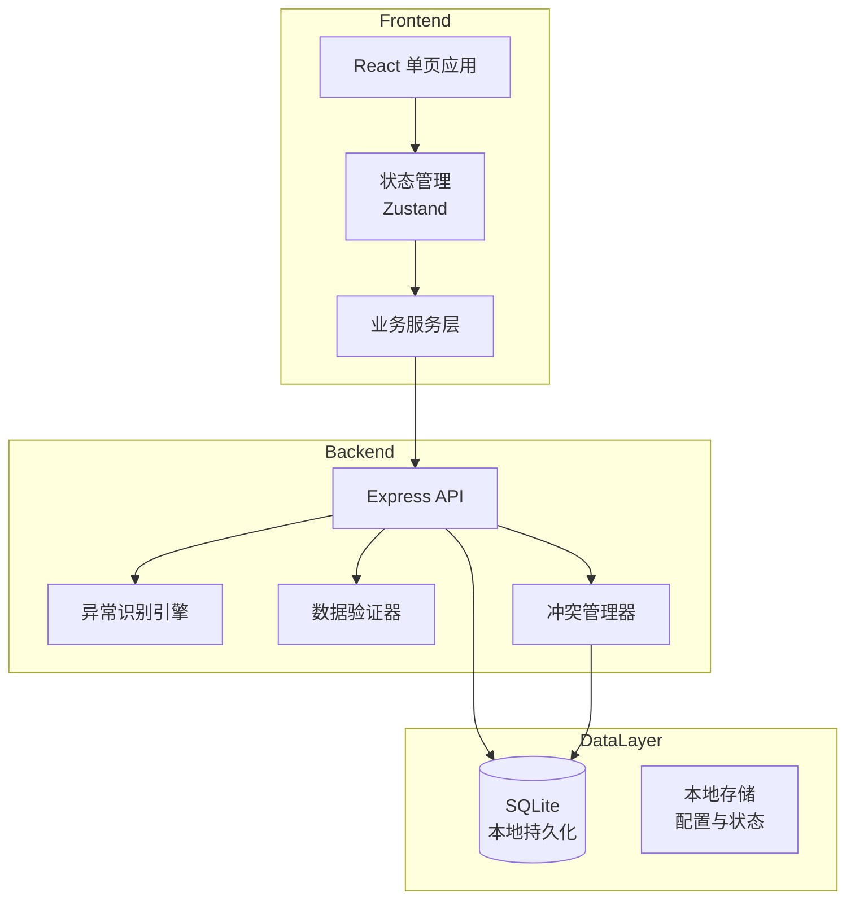
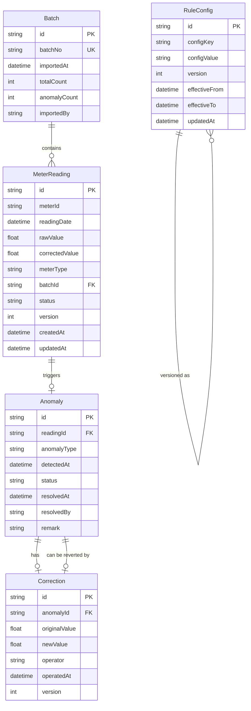

# 能源计量数据异常复核与修正系统 - 技术架构

## 1. 架构设计

### 1.1 系统架构图



### 1.2 技术栈

| 层级 | 技术选型 | 说明 |
|------|----------|------|
| 前端框架 | React@18 + TypeScript | 类型安全，组件化开发 |
| 构建工具 | Vite | 快速开发体验 |
| 样式方案 | Tailwind CSS | 原子化CSS |
| 状态管理 | Zustand | 轻量级状态管理 |
| 数据存储 | SQLite (better-sqlite3) | 本地持久化，支持事务 |
| 文件解析 | xlsx | Excel/CSV解析 |
| 数据导出 | xlsx导出 | 生成Excel报表 |
| 路由管理 | React Router | SPA路由 |
| 日期处理 | date-fns | 日期格式化与计算 |

## 2. 目录结构

```
energy-meter-review/
├── public/
│   └── index.html
├── src/
│   ├── components/          # UI组件
│   │   ├── common/          # 通用组件
│   │   ├── dashboard/       # 仪表盘
│   │   ├── import/          # 导入模块
│   │   ├── review/          # 复核模块
│   │   ├── config/          # 配置模块
│   │   └── export/          # 导出模块
│   ├── pages/               # 页面组件
│   ├── services/            # 业务逻辑层
│   │   ├── anomaly/         # 异常识别
│   │   ├── correction/      # 修正管理
│   │   ├── batch/           # 批次管理
│   │   └── conflict/        # 冲突检测
│   ├── store/               # 状态管理
│   ├── types/               # TypeScript类型
│   ├── utils/               # 工具函数
│   ├── db/                  # 数据库操作
│   ├── App.tsx
│   └── main.tsx
├── package.json
├── tsconfig.json
├── vite.config.ts
└── tailwind.config.js
```

## 3. 数据模型

### 3.1 ER图



### 3.2 数据表DDL

```sql
CREATE TABLE IF NOT EXISTS batches (
    id TEXT PRIMARY KEY,
    batch_no TEXT UNIQUE NOT NULL,
    imported_at TEXT NOT NULL,
    total_count INTEGER DEFAULT 0,
    anomaly_count INTEGER DEFAULT 0,
    imported_by TEXT
);

CREATE TABLE IF NOT EXISTS meter_readings (
    id TEXT PRIMARY KEY,
    meter_id TEXT NOT NULL,
    reading_date TEXT NOT NULL,
    raw_value REAL NOT NULL,
    corrected_value REAL,
    meter_type TEXT NOT NULL,
    batch_id TEXT,
    status TEXT DEFAULT 'RAW',
    version INTEGER DEFAULT 1,
    created_at TEXT NOT NULL,
    updated_at TEXT NOT NULL,
    FOREIGN KEY (batch_id) REFERENCES batches(id)
);

CREATE TABLE IF NOT EXISTS anomalies (
    id TEXT PRIMARY KEY,
    reading_id TEXT NOT NULL,
    anomaly_type TEXT NOT NULL,
    detected_at TEXT NOT NULL,
    status TEXT DEFAULT 'PENDING',
    resolved_at TEXT,
    resolved_by TEXT,
    remark TEXT,
    FOREIGN KEY (reading_id) REFERENCES meter_readings(id)
);

CREATE TABLE IF NOT EXISTS corrections (
    id TEXT PRIMARY KEY,
    anomaly_id TEXT NOT NULL,
    original_value REAL NOT NULL,
    new_value REAL NOT NULL,
    operator TEXT NOT NULL,
    operated_at TEXT NOT NULL,
    version INTEGER NOT NULL,
    FOREIGN KEY (anomaly_id) REFERENCES anomalies(id)
);

CREATE TABLE IF NOT EXISTS rule_configs (
    id TEXT PRIMARY KEY,
    config_key TEXT NOT NULL,
    config_value TEXT NOT NULL,
    version INTEGER NOT NULL,
    effective_from TEXT NOT NULL,
    effective_to TEXT,
    updated_at TEXT NOT NULL
);

CREATE TABLE IF NOT EXISTS export_records (
    id TEXT PRIMARY KEY,
    export_type TEXT NOT NULL,
    params TEXT,
    downloaded_at TEXT NOT NULL,
    downloaded_by TEXT
);

CREATE INDEX idx_meter_readings_meter_date ON meter_readings(meter_id, reading_date);
CREATE INDEX idx_meter_readings_batch ON meter_readings(batch_id);
CREATE INDEX idx_anomalies_status ON anomalies(status);
CREATE INDEX idx_anomalies_reading ON anomalies(reading_id);
```

## 4. API设计

### 4.1 批次管理

| 接口 | 方法 | 说明 | 请求体 | 响应 |
|------|------|------|--------|------|
| `/api/batches` | POST | 导入批次 | `{ readings: [...] }` | `{ batchId, importedCount, anomalyCount }` |
| `/api/batches` | GET | 查询批次列表 | - | `Batch[]` |
| `/api/batches/:id` | GET | 批次详情 | - | `Batch & { readings }` |
| `/api/batches/:id` | DELETE | 删除批次 | - | `{ success }` |

### 4.2 异常管理

| 接口 | 方法 | 说明 | 请求体 | 响应 |
|------|------|------|--------|------|
| `/api/anomalies` | GET | 查询异常列表 | `?status=PENDING&type=JUMP` | `Anomaly[]` |
| `/api/anomalies/:id/correct` | POST | 修正异常 | `{ newValue }` | `{ success, version }` |
| `/api/anomalies/:id/ignore` | POST | 忽略异常 | `{ remark }` | `{ success }` |
| `/api/anomalies/:id/revert` | POST | 撤销异常 | - | `{ success }` |

### 4.3 规则配置

| 接口 | 方法 | 说明 | 请求体 | 响应 |
|------|------|------|--------|------|
| `/api/rules` | GET | 获取当前规则 | - | `RuleConfig[]` |
| `/api/rules` | PUT | 更新规则 | `{ configs }` | `{ success, newVersion }` |
| `/api/rules/history` | GET | 规则历史版本 | - | `RuleConfig[]` |
| `/api/rules/:version/rollback` | POST | 回滚到指定版本 | - | `{ success }` |

### 4.4 导出

| 接口 | 方法 | 说明 | 请求体 | 响应 |
|------|------|------|--------|------|
| `/api/export/detail` | POST | 导出明细 | `{ dateFrom, dateTo, meterType }` | Excel文件 |
| `/api/export/summary` | POST | 导出汇总 | `{ dateFrom, dateTo }` | Excel文件 |
| `/api/exports` | GET | 导出记录 | - | `ExportRecord[]` |

## 5. 核心业务逻辑

### 5.1 异常识别引擎

```typescript
interface AnomalyRule {
  type: 'JUMP' | 'MISSING' | 'ROLLBACK';
  detect: (current: MeterReading, previous?: MeterReading) => boolean;
  autoFix: boolean;  // 是否允许自动修正
}

const anomalyRules: AnomalyRule[] = [
  {
    type: 'JUMP',
    detect: (current, previous) => {
      if (!previous) return false;
      const threshold = getRule('jumpThreshold'); // e.g., 50%
      const diff = Math.abs(current.rawValue - previous.correctedValue || previous.rawValue);
      const avgDaily = diff / daysDiff(current, previous);
      const expectedMax = avgDaily * (1 + threshold);
      return diff > expectedMax;
    },
    autoFix: true
  },
  {
    type: 'ROLLBACK',
    detect: (current, previous) => {
      if (!previous) return false;
      return current.rawValue < (previous.correctedValue || previous.rawValue);
    },
    autoFix: false  // 回退不能自动修正，需人工介入
  }
];
```

### 5.2 冲突检测机制

```typescript
async function submitCorrection(anomalyId: string, newValue: number, version: number) {
  const anomaly = await db.getAnomaly(anomalyId);
  
  if (anomaly.currentVersion !== version) {
    throw new ConflictError('数据已被其他用户修改，请刷新后重试');
  }
  
  // 版本号检查通过后，使用事务更新
  return db.transaction(async () => {
    const updated = await db.updateCorrection(anomalyId, newValue, version + 1);
    if (!updated) {
      throw new ConflictError('提交失败，版本冲突');
    }
    return updated;
  });
}
```

### 5.3 撤销恢复逻辑

```typescript
async function revertCorrection(anomalyId: string) {
  const corrections = await db.getCorrectionHistory(anomalyId);
  if (corrections.length < 2) {
    throw new Error('无历史记录可撤销');
  }
  
  const lastCorrection = corrections[corrections.length - 1];
  const previousValue = corrections.length > 1 
    ? corrections[corrections.length - 2].originalValue 
    : lastCorrection.originalValue;
  
  return db.transaction(async () => {
    await db.createRevertRecord(anomalyId, previousValue);
    await db.updateAnomalyStatus(anomalyId, 'REVERTED');
    await db.updateReadingValue(lastCorrection.readingId, previousValue);
  });
}
```

### 5.4 重复导入检测

```typescript
async function checkDuplicateImport(readings: MeterReading[]) {
  const signatures = readings.map(r => `${r.meterId}-${r.readingDate}-${r.rawValue}`);
  const existing = await db.findBySignatures(signatures);
  
  if (existing.length > 0) {
    return {
      isDuplicate: true,
      existingRecords: existing,
      message: `检测到 ${existing.length} 条重复记录`
    };
  }
  return { isDuplicate: false };
}
```

## 6. 状态管理

### 6.1 全局状态 (Zustand Store)

```typescript
interface AppState {
  // 批次状态
  batches: Batch[];
  currentBatch: Batch | null;
  
  // 异常状态
  anomalies: Anomaly[];
  selectedAnomaly: Anomaly | null;
  
  // 规则状态
  currentRules: RuleConfig[];
  ruleHistory: RuleConfig[];
  
  // 导出状态
  exportRecords: ExportRecord[];
  
  // UI状态
  loading: boolean;
  error: string | null;
  
  // 操作
  setAnomalies: (anomalies: Anomaly[]) => void;
  correctAnomaly: (id: string, value: number) => Promise<void>;
  ignoreAnomaly: (id: string, remark: string) => Promise<void>;
  revertAnomaly: (id: string) => Promise<void>;
}
```

## 7. 数据持久化策略

### 7.1 SQLite配置

- 数据库文件位置：`./data/energy_review.db`
- 启用WAL模式提高并发性能
- 定期执行VACUUM保持数据库健康

### 7.2 配置持久化

规则配置存储于：
- `rule_configs` 数据表（数据库）
- `localStorage` 缓存（前端快速读取）

系统启动时从数据库加载最新配置到内存缓存。

## 8. 安全性考虑

- 操作日志完整记录（谁、何时、做了什么）
- 原始数据不可修改，仅通过新增修正记录实现变更
- 版本号机制防止并发冲突
- 导出记录可追溯

## 9. 性能优化

- 批量导入使用事务减少IO
- 异常检测异步执行，不阻塞主流程
- 列表分页加载，避免大数据量内存溢出
- 规则缓存减少数据库查询
